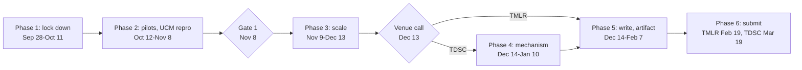

# Idea 3 Submission Roadmap

**Date:** 24 Sep 2026
**Living version:** the Claude Doc "Idea 3 Submission Roadmap" (https://claude.ai/artifact/HPz3pfVtDoW7hc3i1QmMC5). Task status lives there as dropdowns; this file is a snapshot for future sessions.
**Supersedes:** the sequencing (§8), venue (§9) and "this week" (§11) sections of `Idea3_Paper_Plan.md`, and the venue line of `Idea3_CORRECTIONS_19Sep2026.md` §8.

Submit to TMLR by 19 Feb 2027, or to IEEE TDSC by 19 Mar 2027 if the mechanism work lands. The path is 38 tasks in six phases, $175 to $480 of API spend, and 45 to 100 hours of your team's time. I run 27 of the 38: 15 need nothing from you and 12 need a key you send and then revoke. The other 11 need people, your accounts, or services my sandbox cannot reach.

## The route

Two checkpoints sit inside phases: the coupling go/no-go on Oct 30 in Phase 2, and Gate 2 on real agents on Dec 6 in Phase 3. On the TDSC route, writing runs about five weeks past Feb 7.

## Tasks by phase

"Runs it" values: Claude (no input), Claude + your key, You, You + team, You in Colab.

### Phase 1: lock down and de-risk (Sep 28 to Oct 11)

| ID | Task | Runs it | Needs from you | Expected result, and what it decides | Time, cost |
| --- | --- | --- | --- | --- | --- |
| 1.1 | Email Prismata's authors: which definition produced the 1.2%, and may we have their labeler output on a shared page set. I draft it. | You | Your sign-off and your email account | Reply expected in 2 to 4 weeks. If they used the task-target path, our reconciliation stands and contribution 1 is clean. If they used any actionable descendant, 49.93% vs 1.2% is a real conflict that their labels settle. | 30 min, $0 |
| 1.2 | Email UCM's authors: we are testing their public code on another corpus; which model and commit reproduce their tables. I draft it. | You | Your sign-off and your email account | Their model and commit for Gate 1, plus the disclosure record reviewers ask for. | 30 min, $0 |
| 1.3 | Fix notebook 02 v2. Its power cell sizes the secondary criticality ratio, not the primary coupling statistic. Add the coupling power table and a go/no-go cell. | Claude | Nothing | The notebook stops before spending when the pilot error rate makes coupling unmeasurable (numbers under Gates). This was my miss on 19 Sep. | 1 h, $0 |
| 1.4 | Update model IDs in all three notebooks: Claude Sonnet 5 and GPT-5.6 Terra for our runs, UCM's own model for its reproduction. Log the model ID beside every result. | Claude | Nothing | Current models at lower cost (Sonnet 5 is $2 per million input tokens against $3 for Sonnet 4.5), and results anyone can re-run. | 30 min, $0 |
| 1.5 | Private GitHub repo with pipeline v2, the 33 tests, notebooks, results and the corrections log. Tag v2.0, then commit after every run. | Claude + your key | A private repo and a fine-grained token scoped to that repo only | Every number in the paper traces to a commit and a passing test (Gate 0). | 1 h, $0 |
| 1.6 | Pre-registration: frame, both criticality definitions, target-free and oracle gates, primary outcomes, thresholds, stopping rules. I draft it; you file it. | You | A free OSF account | A timestamped protocol. It keeps the sampling-frame argument we make against Prismata from being turned on us. | 30 min of yours, $0 |
| 1.7 | Annotation guide plus a web annotation app with a shared database, so labels reach me without passing files around. | Claude | Names of 2 annotators; you share the link | App ready by Oct 9. About 1 minute per item. | 1 day, $0 |
| 1.8 | Notebook 01 Part 1 on all 57 sites: how much data-* survives per site. | Claude | Nothing | If no site keeps data-*, the archive head-to-head with UCM is dead everywhere and only live pages count. | 20 min, $0 |
| 1.9 | Clone UCM, build its 10 self-hosted sites in Docker here, dry-run its detector. | Claude | Optional: a Docker Hub read-only token, since anonymous pulls hit a rate limit in testing | A list of which UCM numbers reproduce here and which need an AWS GitLab server. | 1 day, $0 |
| 1.10 | Pull the other 8 Mind2Web train shards, about 5 GB. | Claude | Nothing | The train split has about 1,009 tasks against the 209 we use, which raises the supply of critical items (229 today). Needed only if coupling goes ahead. | 1 h, $0 |
| 1.11 | Decide the team, the 2 annotators, spend caps, the corresponding author and affiliation, and TMLR or TDSC intent. | You | 1 hour of your time | Fixes who owns each You row, the fee route, and the key caps. | 1 h, $0 |
| 1.12 | Weekly competitor watch: Prismata v2 or code, UCM v2, anything citing either. | Claude | A yes when I ask to set up the scheduled task | Early warning for Gate 3, as a report every Monday. | 5 min a week, $0 |

### Phase 2: ground truth, pilots, reproduction (Oct 12 to Nov 8)

| ID | Task | Runs it | Needs from you | Expected result, and what it decides | Time, cost |
| --- | --- | --- | --- | --- | --- |
| 2.1 | Human annotation pilot: 2 annotators label the same 300 regions, stratified by site and by heuristic outcome (agreements, disagreements, heuristic negatives). | You + team | About 5 hours per annotator | Inter-annotator kappa of 0.70 or better, and our heuristic's precision and recall against people. Decides whether the heuristic can stand in for human labels anywhere, or every number needs them. | 10 h total, $0 |
| 2.2 | Vendor labeling pilot on the same 300: Claude Sonnet 5, GPT-5.4-mini and GPT-5.4-nano (the last two are in Prismata's own model panel). | Claude + your key | Anthropic and OpenAI keys | Each model's false-trust rate against people, and a first coupling estimate with an interval. Replaces the 29.4% disagreement figure as the base rate and drives the coupling go/no-go on Oct 30. | 1 h, about $1 |
| 2.3 | Gemini 3 Flash arm of 2.2, the third model in Prismata's panel. Optional. | You in Colab | Your Gemini key, used in Colab | The same outputs for the third panel model. My sandbox's network policy blocks Google's API, so this arm cannot run here. | 30 min, under $1 |
| 2.4 | Notebook 03 v2 real-agent pilot: 16 conditions, 40 trials each, plus the paired no-injection control, 1,280 calls through the Batch API. | Claude + your key | Anthropic key | Compliance against the controller's upper bound, and whether the 0% narrow vs 96.9% page-wide contrast survives a real agent. First read on Gate 2. | 1 day, $11 to $22 |
| 2.5 | UCM reproduction for Gate 1: their boundary F1 on Booking, Reddit and GitLab pages, plus 60 agent episodes on 3 of their self-hosted sites. | Claude + your key | Anthropic key, and the OpenAI key if their judge needs it | F1 inside their reported intervals (0.997, 0.879, 0.840) and attack success inside theirs on the self-hosted sites. Decides Gate 1. | 2 days, $15 to $40 |
| 2.6 | UCM's WASP numbers on WebArena GitLab. Optional: run it only if 2.5 fails or a reviewer insists. | You | Your AWS account and a machine with Docker; their README starts the GitLab server on AWS | The GitLab half of their paper reproduced. I cannot host or reach a long-running AWS GitLab server from here. | 6 to 10 h, $45 to $120 |
| 2.7 | Notebook 01 Part 2 live capture: the 7 study sites plus up to 10 more, zipped and uploaded to me. | You in Colab | Colab or your laptop; a home connection gets blocked less than a data center | A live corpus with data-* density per site, and a refusal list that doubles as a deployability finding. I do not fetch commercial sites from my sandbox. | 1 h, $0 |
| 2.8 | Notebook 01 Part 3: UCM's detector with its pinned prompt on archive and live pages, scored against the human labels from 2.1 where they overlap. | Claude + your key | Anthropic key and the zip from 2.7 | Detector F1 against semantic class ratio, archive vs live. Decides whether the UCM head-to-head runs on live pages only. | 1 day, $3 to $13 |

Gate 1 closes this phase on Nov 8.

### Phase 3: experiments at scale (Nov 9 to Dec 13)

| ID | Task | Runs it | Needs from you | Expected result, and what it decides | Time, cost |
| --- | --- | --- | --- | --- | --- |
| 3.1 | Confirmatory coupling study, only if the Oct 30 go/no-go says go. People label every item; the vendors label the same items. | You + team | 9 to 44 annotation hours, set by the pilot's error rate | Coupling (kappa) with a site-bootstrap interval, and the criticality ratio as a secondary result. Says whether two vendors fail on the same items, and so whether ensembling helps. | 2 to 3 weeks, $2 to $7 |
| 3.2 | Real agents from 3 model families on the 8 headline conditions, 100 trials each plus paired controls: Claude Sonnet 5 and GPT-5.6 Terra here, Gemini 3 Flash in Colab. | Claude + your key | Both keys; you run the Gemini arm (1 to 2 h) | Compliance per family with intervals, and the gap between mechanism and behaviour. Decides Gate 2 on Dec 6. | 1 week, about $27 here plus $5 to $10 in Colab |
| 3.3 | Mislabel by criticality on UCM's self-hosted sites: one wrong label at a critical vs a non-critical position, under UCM's typed output channel vs a free-text variant. | Claude + your key | Anthropic key | The two-system contrast. Prediction: the typed channel degrades gracefully and the text channel does not. This is the evidence that the finding reaches beyond one system. | 1 to 2 weeks, $60 to $150 |
| 3.4 | Measure the envelope an LLM actually picks when it scopes a task the Prismata way, on the 1,163 pages. Place it on the gate-width curve and rerun influence escape at that width. | Claude + your key | Anthropic key | One measured operating point in place of today's bracket (0% narrow, 43.4% page-wide). | 3 days, $24 to $35 |
| 3.5 | UCM deployment cost: CSS selectors needed per site across 57 sites, and how many break between the 2023 archive and 2026 live pages. | Claude + your key | Anthropic key and the live pages from 2.7 | A selectors-per-site distribution and a breakage rate: a cheap, new number on whether the approach survives site redesigns. | 2 days, about $11 |
| 3.6 | Sensitivity analyses: region root counted or not, unit granularity, target-free vs oracle gate, 3 vs all trajectories, one site held out at a time, seeds. | Claude | Nothing | Every headline number with its range under each definition, so no single choice carries a claim. | 3 days, $0 |

Gate 2 falls on Dec 6 and the venue call on Dec 13.

### Phase 4: the mechanism, TDSC route only (Dec 14 to Jan 10)

On the TMLR route, skip this phase and put the weeks into 3.6 and writing.

| ID | Task | Runs it | Needs from you | Expected result, and what it decides | Time, cost |
| --- | --- | --- | --- | --- | --- |
| 4.1 | Build criticality-conditioned verification: a second labeling call only on untrusted regions inside the gate-admitted set. That is about 1.2 regions per trajectory at K = 21, against 25 with no gate. | Claude + your key | Anthropic key | A working prototype with a bounded extra cost per page. This is the systems contribution TDSC asks for. | 2 weeks, $15 to $40 |
| 4.2 | Evaluate it: coverage, added latency, false blocks, and residual effect against both defenses unmodified, including an attacker who knows the verifier exists. | Claude + your key | Anthropic key | TDSC becomes the target if residual effect falls at bounded cost. If not, the TMLR route stands and no time is lost. | 2 weeks, $25 to $60 |

### Phase 5: writing, figures, artifact, review (Dec 14 to Feb 7)

| ID | Task | Runs it | Needs from you | Expected result, and what it decides | Time, cost |
| --- | --- | --- | --- | --- | --- |
| 5.1 | Claims ledger: every claim in the paper mapped to its evidence file, commit and test. | Claude | Nothing | The check that catches the 19 Sep class of error before a reviewer does. | 2 days, $0 |
| 5.2 | Figures: the reconciliation ladder, the gate-width curve in oracle and deployable forms, the confinement contrast, four-layer bars, a per-site heatmap. | Claude | Nothing | Five figures from frozen results, each rebuilt by one script. | 3 days, $0 |
| 5.3 | Full draft: introduction, threat model, method, results, related work, limitations, ethics and disclosure. I draft; your team edits. | Claude | 20 to 30 editing hours across the team | A complete draft by Jan 24, which leaves two weeks for review and fixes. | 3 weeks, $0 |
| 5.4 | Artifact: clean repo, one-command reproduction, README, frozen data. I prepare it; you publish it. | Claude | Your GitHub account for the public release and a Zenodo account for the DOI | A citable artifact with a DOI, linked from the paper's first page. | 3 days, $0 |
| 5.5 | Internal adversarial review: a fresh reviewer with no project context tries to kill each claim, the method of the 19 Sep audit, plus one colleague. | Claude | One colleague, about 4 hours | A list of fixes. A construct-validity failure here triggers stop condition 4. | 1 week, $0 |
| 5.6 | Dated re-run of every number from the tagged commit, then freeze. | Claude + your key | Both keys again; you rerun the Colab arms | Every number in the paper produced on one date from one commit. | 3 days, $20 to $40 |

### Phase 6: submission (Feb 8 to Feb 19)

| ID | Task | Runs it | Needs from you | Expected result, and what it decides | Time, cost |
| --- | --- | --- | --- | --- | --- |
| 6.1 | Format and anonymize: the TMLR LaTeX template under double-blind review, or the IEEE template for TDSC. | Claude | Nothing | A submission PDF with the artifact link anonymized for review. | 2 days, $0 |
| 6.2 | arXiv preprint. TMLR accepts papers already posted to arXiv. | You | Your arXiv account. A first cs.CR submission may need an endorsement, so ask early | A public, dated claim to the result, which also guards against Gate 3. | 1 h, $0 |
| 6.3 | Submit on OpenReview for TMLR, or ScholarOne for TDSC: authors, conflicts, suggested action editors. | You | Your OpenReview or ScholarOne account | Submitted by 19 Feb 2027 (TMLR) or 19 Mar 2027 (TDSC). TMLR assigns an action editor within a week. | 2 h, $0 |
| 6.4 | Reviews: I draft point-by-point responses and any extra runs; you post them. | Claude | You post the responses | A revision inside the discussion window. TMLR charges no fees at any stage. | 1 to 2 weeks after reviews, $0 to $30 |

## Gates

Seven checkpoints decide the route. Each pass condition is fixed now, before any of the data exists.

| Gate | Date | Passes when | If it passes | If it fails |
| --- | --- | --- | --- | --- |
| Gate 0: measurement discipline | Standing | A number has a commit, a passing test and a named construct check | It can enter the paper | It stays out, whatever it shows |
| Coupling go/no-go | 30 Oct 2026 | The pilot's false-trust rate against people is 20% or more per vendor, or 10% with 2 annotators free for about 44 hours | Run 3.1 | Report the pilot's kappa with its interval and drop 3.1. The paper does not depend on it |
| Gate 1: UCM reproduces | 8 Nov 2026 | Their boundary F1 lands inside their intervals on at least 2 of 3 sites, and attack success inside theirs on the self-hosted sites | A two-system comparative paper | Ask the authors. If unresolved, a one-system paper, still viable at TMLR as a reproducibility study |
| Gate 2: real agents | 6 Dec 2026 | Compliance is measured for 3 model families with intervals, and the narrow vs page-wide contrast holds or its absence is explained | The risk framing stays | Effect rates become mechanism upper bounds. The definitional and confinement results stand either way |
| Venue call | 13 Dec 2026 | You want TDSC and two people are free for Phase 4 | Attempt Phase 4 | TMLR route, submit Feb 19 |
| Mechanism check | 10 Jan 2027 | 4.1 cuts residual effect at a bounded cost per page | TDSC route, submit Mar 19 | Fall back to TMLR. Writing ran in parallel, so the slip is about a week |
| Gate 3: scooped | Weekly | Nobody publishes the definitional audit or the deployment measurement first | Carry on | Repackage around what is still unique, same venue |

**The coupling go/no-go in numbers.** Items needed for 80% power to detect coupling of 2x, with site clustering priced in (design effect 2.68):

| Per-vendor false-trust rate | Items needed | Annotation hours | Call |
| --- | --- | --- | --- |
| 20% | 469 | about 9 | Go |
| 10% | 2,192 | about 44 | Go only with 2 annotators and the extra shards from 1.10 |
| 5% | 9,084 | about 180 | No-go |

Today's shards supply at most 1,660 eligible items, so the 10% row needs task 1.10 first.

**Stop conditions.** Any one of these says do not submit to a good journal:

1. UCM does not reproduce from its own code, and its authors do not answer.
2. Real agents almost never follow a visible injection, so every effect rate collapses and the paper shrinks to a short mechanism note.
3. Someone publishes the definitional audit first.
4. Another construct-validity failure of the 19 Sep kind. One round showed the process works; two would show it does not.

None of the four is true today.

## Who runs what

15 tasks need nothing from you, and I can start 9 of them today along with the drafts for 1.1, 1.2 and 1.6. Another 12 need a key. The other 11 need you, your team, or your accounts.

### I can do now, with nothing from you

- Draft both author emails (1.1, 1.2) and the pre-registration (1.6).
- Fix notebook 02's sizing and update the model IDs (1.3, 1.4).
- Build the annotation guide and the annotation app (1.7).
- Run notebook 01 Part 1 on all 57 sites (1.8), set up UCM in Docker (1.9), and pull the other Mind2Web shards (1.10).
- Sensitivity analyses (3.6), the claims ledger (5.1), and figures from the frozen results (5.2).

### I can run once you send these

| What to send | Scope and cap | Unlocks | Expected spend |
| --- | --- | --- | --- |
| Anthropic API key | A new workspace just for this project, with a $300 monthly spend limit. Start at $100 for Phase 2 | 2.2, 2.4, 2.5, 2.8, 3.1 to 3.5, 4.1, 4.2, 5.6 | $155 to $430 |
| OpenAI API key | A project key with a $60 budget | The GPT-5.4-mini and nano labelers (2.2, 3.1), the GPT-5.6 Terra agent (3.2), and UCM's GPT runs if its judge needs them (2.5) | $20 to $50 |
| GitHub fine-grained token | One private repo, Contents read and write, 90-day expiry | 1.5 and every commit after it | $0 |
| Docker Hub read-only token (optional) | A free account | Fewer failed image pulls in 1.9, 2.5 and 3.3 | $0 |
| Information | Team names and weekly hours, the 2 annotators, the corresponding author and affiliation, spend caps, venue intent | 1.7, 1.11 and the fee route | $0 |

My sandbox has 2 CPUs, 7 GB of RAM, 29 GB of free disk and no GPU. It reaches Anthropic, OpenAI, Hugging Face and GitHub and runs Docker. It cannot reach Google's Gemini API.

### Only you can do

| Tasks | Where | Why not me | Your time |
| --- | --- | --- | --- |
| 1.1, 1.2 author emails | Your email | They must come from an author | 1 h |
| 2.1, 3.1 annotation | The app from 1.7 | Ground truth needs people | 10 h, plus 9 to 44 h if coupling goes ahead |
| 2.7 live capture | Colab or your laptop | I do not fetch commercial sites from my sandbox, and data-center addresses get blocked more | 1 h |
| 2.3, 3.2 Gemini arms | Colab | My sandbox's network policy blocks Google's API | 1 to 2 h |
| 2.6 WASP on GitLab (optional) | Your AWS account and a machine with Docker | It needs your AWS account and a server that runs for days | 6 to 10 h |
| 1.6, 5.4, 6.2, 6.3 accounts | OSF, GitHub, Zenodo, arXiv, OpenReview | Each is tied to your identity | 4 to 6 h |
| 1.11 and the gate calls | Here | They are your decisions | 2 h |
| 5.3 edits and sign-off | The draft | Authorship | 20 to 30 h across the team |

### How to send a key

- Make a fresh key for this project and set its spend cap before you send it.
- Send it when I say I am ready to run the task that needs it, not before.
- I keep it in a file only my process can read, never print it, and never put it in a notebook, the project or this doc. I delete it when the run ends.
- The key stays in this chat's history, so revoke it right after the run. Revoking is the step that protects you.
- My sandbox is temporary, so each run finishes in one working session and its results go to the project the same day.

## Budget

API spend is $175 to $380 on the TMLR route and $215 to $480 on the TDSC route. People's time costs more: 45 to 100 hours across the team.

| Phase | API spend, my runs | API spend, your runs | Human hours | Main driver |
| --- | --- | --- | --- | --- |
| 1 | $0 | $0 | about 3 | emails, decisions, OSF |
| 2 | $30 to $76 | under $1, plus $45 to $120 if you run 2.6 | about 12 | annotation pilot, 10 h |
| 3 | $124 to $230 | $5 to $10 | 1 to 46 | coupling annotation, only on a go |
| 4, TDSC only | $40 to $100 | $0 | 0 | mechanism runs |
| 5 | $20 to $40 | $1 to $2 | 26 to 36 | editing 20 to 30 h, review 4 h |
| 6 | $0 to $30 | $0 | about 4 | accounts, submission, responses |
| Total | $175 to $380 (TMLR), $215 to $480 (TDSC) | $6 to $13, plus the optional $45 to $120 | 45 to 100 | the whole route |

The estimates rest on measured token sizes (2.87 characters per token for agent observations, 3.98 for sanitized HTML), September 2026 list prices, and the Batch API's 50% discount wherever calls are independent. Multi-step agent episodes (2.5, 3.3) are the least certain lines.

## Venue

Aim at TMLR, keep IEEE TDSC as the stretch if the mechanism works, and treat ACM DTRAP as the floor.

| Route | Venue | Grade | Why it fits | What it demands | Fees |
| --- | --- | --- | --- | --- | --- |
| Primary | TMLR | A+ | It accepts on two tests: the evidence supports the claims, and some readers learn from it. Novelty and state of the art are not required, and a reproducibility study with general lessons qualifies. It also offers a Reproducibility certification. | Real-agent results (3.2), so ML readers see how real models behave. Double-blind formatting. | None at any stage |
| Stretch | IEEE TDSC | A+ | 20 core LLM and agent security papers in the audit year, the most of any journal checked | A systems contribution. Its stated avoid line is an LLM benchmark without one, so Phase 4 must land | $0 subscription route; $2,800 for optional open access |
| Floor | ACM DTRAP | B+ | Measurement with operational relevance is its stated best fit | Little precedent: no LLM or agent security paper in the audit year, out of 6 papers in scope | ACM open access; the charge depends on the corresponding author's institution, so check at submission |

This moves DTRAP from primary in the 19 Sep plan to the floor. The venue audit shows DTRAP and ACM TOPS each published no LLM or agent security paper in its year, while TMLR published agent-security work such as Firewalls to Secure Dynamic LLM Agentic Networks and reviews for correctness, which is this paper's strength. Computers & Security stays excluded, because its author guide rules out AI and ML security work.

## Sources

- Prismata, arXiv:2607.08147 (https://arxiv.org/abs/2607.08147): still version 1 with no code link as of Sep 24.
- UCM repository README (https://github.com/ethz-spylab/untrusted-content-masking): Docker Compose, uv and Playwright; Anthropic and OpenAI keys; an AWS GitLab server for the WASP runs.
- Claude API pricing (https://platform.claude.com/docs/en/about-claude/pricing): Sonnet 5 at $2 and Sonnet 4.5 at $3 per million input tokens, Batch at 50% off.
- OpenAI API pricing (https://openai.com/api/pricing/): GPT-5.6 Terra at $2 per million input tokens, Batch at 50% off.
- GPT-5.4-mini pricing (https://pricepertoken.com/pricing-page/model/openai-gpt-5.4-mini): $0.75 in and $4.50 out per million tokens, not marked deprecated.
- TMLR acceptance criteria (https://jmlr.org/tmlr/acceptance-criteria.html) and editorial policies (https://jmlr.org/tmlr/editorial-policies.html): the two acceptance tests, no fees, an action editor within a week, the certifications.
- ACM's 2026 open access model (https://dis.acm.org/2026/acms-new-open-access-publishing-model/): charges follow the corresponding author's institution.
- Venue audit snapshot of 10 Jul 2026: grades, precedent counts and fee routes for 25 journals.
- Measured this session: which APIs the sandbox reaches and that Docker runs; item supply under notebook 02's filters (1,660 items and 229 critical on the current shards); the coupling power table (simulation, 800 draws per point); token sizes with the o200k tokenizer as a proxy. Scripts and outputs: `roadmap/budget_nb2.*`, `roadmap/budget_nb13.*`, `roadmap/tokens_and_coupling.*`.
- Project docs behind the numbers: Idea3_Reconciliation_1.2pct, Idea3_Corrected_Ablation_Results, Idea3_Corrected_Figures and Idea3_CORRECTIONS_19Sep2026.
